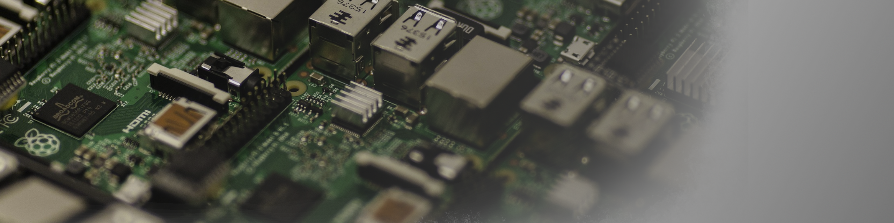

<link rel="stylesheet" type='text/css' href="https://cdn.jsdelivr.net/gh/devicons/devicon@latest/devicon.min.css" />
          

<h1 align="Left">Hello World!! I am Douglas Henrique </h1>

<!-- 

    
    ¹
    ²
    

 -->

<h2 align="center">About me</h2>

* I'm form state of São Paulo, Brazil.
* I'm graduate in Systems Analysis an Development.
* I'm learning software engineer, UX/UI Design and game development.
* I'm open to collaborating. You can contact me at [douglas.dionysio@outlook.com.br](mailto:douglas.dionysio@outlook.com.br).

 
 

<h2 align="center">Technical Skills</h2>

 

<table align="center">
  <!-- row 1 -->
  <tr>
    <td colspan="2">
      <h3 align="left">Programming Languages:</h3>
      

        
        
        
        
      

    </td>
  </tr>
  <!-- row 2 -->
  <tr>
    <td>
      <h3 align="left">Back-end & Fullstack</h3>
      

        
        
        
        
        
        
        
        
        
        
        
      

    </td>
    <td>
      <h3 align="left">Front-end</h3>
      

        
        
        
        
        
        
        
        
        
        
        
        
      

    </td>
  </tr>
  <!-- row 3 -->
  <tr>
    <td>
      <h3>Database</h3>
      

        
        
        
        
      

    </td>
    <td>
      <h3 align="left">Infrastructure & DevOps</h3>
      

        
        
        
        
        
        
        
        
      

    </td>
  </tr>
  <!-- row 4 -->
  <tr>
    <td>
      <h3 align="left">Tools & Productivity</h3>
      

        
        
        
        
        
        
        
        
        
        
      

    </td>
    <td>
      <h3 align="left">Design & Prototyping</h3>
      

        
        
        
        
        
        
        
        
      

    </td>
  </tr>
  <!-- row 5 -->
  <tr>
    <td>
      <h3 align="left">Game Development</h3>
        

          
        

    </td>
    <td>
      <h3 align="left">Microcontrollers & Hardware</h3>
      

        
        
        
        
      

    </td>
  </tr>
  <!-- 6 row -->
  <tr>
    <td colspan="2">
      <h3 align="left">Technologies Learned in College (Not Frequently Used)</h3>
      

        
        
        
        
        
        
        
        
        
        
      

    </td>
  </tr>
</table>

###

<h2 align="center">My GitHub States</h2>

  
  

  

  

